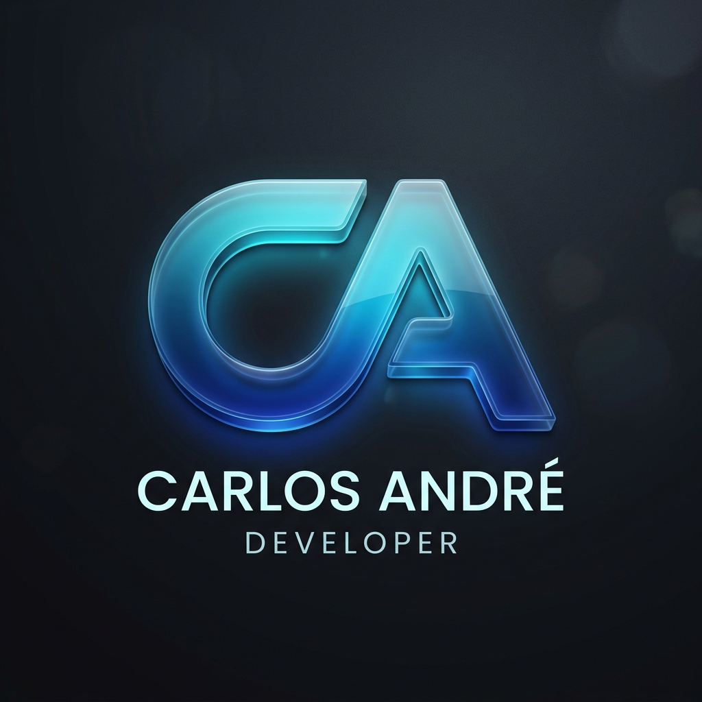

# 🏆 Rank&Hub | Ecossistema de Rankings & Gamificação

  
   
  <h3>O Centro da sua Evolução.</h3>
  
<b>Acesse agora:</b> <a href="https://rankehub.vercel.app">rankehub.vercel.app</a>

---

## 📖 O que é o Rank&Hub?

O **Rank&Hub** é uma plataforma SaaS premium projetada para transformar qualquer competição ou acompanhamento de progresso em uma experiência épica. Combinando design de elite, inteligência artificial e gamificação agressiva, o sistema permite criar rankings personalizados, gerenciar tarefas e engajar membros em um ambiente de alta performance.

---

## 📸 Screenshots

  <h3>Identity & Auth</h3>
  
  
<i>Interface de autenticação com logo dinâmica e efeitos de orbital glow.</i>

  
   
  
  <h3>Dashboard Central</h3>
  
  
<i>Visão geral do ecossistema, estatísticas globais e criação com IA.</i>

   

  <h3>Arenas de Competição</h3>
  
  
<i>Tabela de pontuação em tempo real com sistema de patentes e histórico.</i>

---

## 🚀 Tecnologias Utilizadas

O projeto utiliza o que há de mais moderno no desenvolvimento full-stack:

### **Frontend**
- **Next.js 15 (App Router)**: SSR e roteamento avançado.
- **Tailwind CSS**: Estilização atômica para performance máxima.
- **Framer Motion**: Micro-interações e animações premium.
- **Context API**: Gestão de estado global (Auth, Temas, UI).

### **Backend & AI**
- **Python / Flask**: API robusta e escalável.
- **Google Gemini 2.5 AI**: Inteligência artificial integrada para automatizar a criação de regras e rankings.
- **SQLite**: Banco de dados relacional para persistência de dados.
- **SMTP Gmail**: Sistema de e-mails transacionais de boas-vindas.

---

## 💎 Diferenciais do Projeto

### 🛠️ **Arquitetura Clean Code**
- **Classes Semânticas (PT-BR)**: Refatoração completa para classes como `.barra-topo`, `.painel-lateral`, facilitando a leitura e manutenção.
- **Modularização**: Componentes reutilizáveis e lógicas separadas por contextos.

### ✨ **Experiência do Usuário (UX)**
- **Logo Dinâmica**: Ícone SVG customizado com animação de pulso.
- **Saudações Inteligentes**: Sistema que reconhece novos usuários e dá as boas-vindas personalizadas.
- **Segurar para Sair**: Sistema de segurança que exige segurar o botão de saída para evitar perda acidental de progresso.

---

## 🔗 Como Acessar

Atualmente, o projeto está em modo de demonstração pública através do link oficial. Todo o gerenciamento de dados é feito em tempo real.

**🔗 Link Oficial:** [https://rankehub.vercel.app](https://rankehub.vercel.app)

---

## 👨‍💻 Autor

**Carlos André** — *Especialista em Soluções SaaS*

Desenvolvido com foco em alta performance e design state-of-the-art. 

---

## 📧 Contato Comercial & Desenvolvedor

---
*© 2026 Rank&Hub - O Centro da sua Evolução.*
