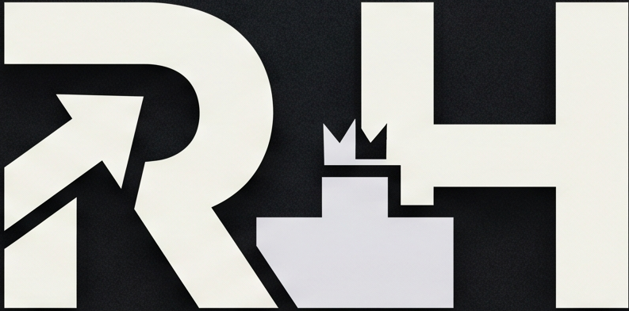
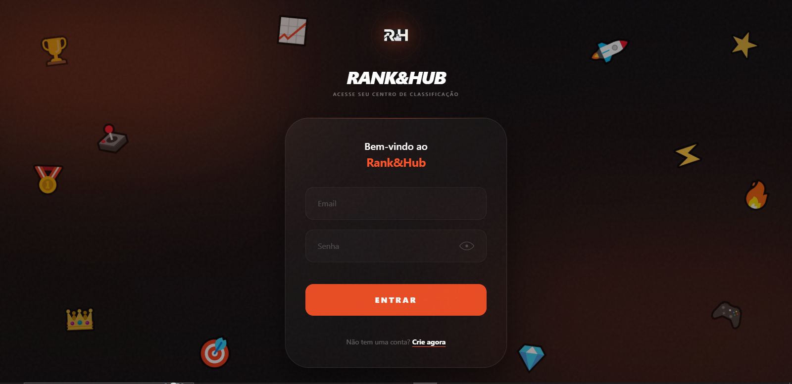
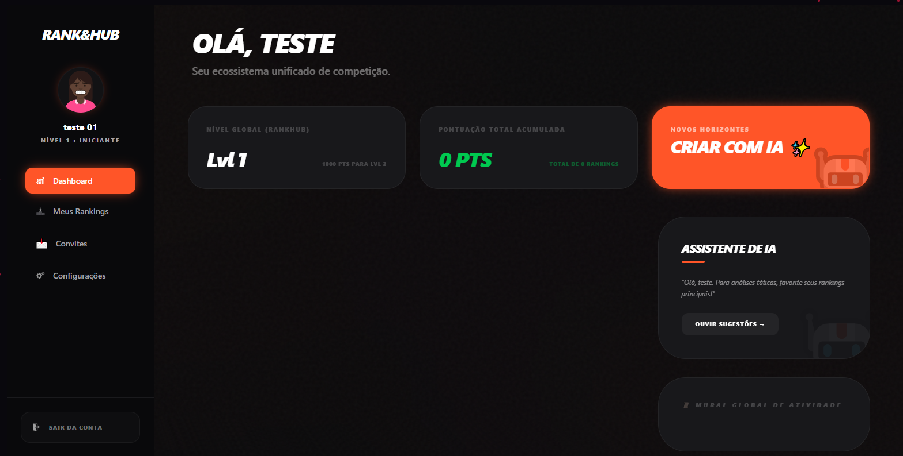
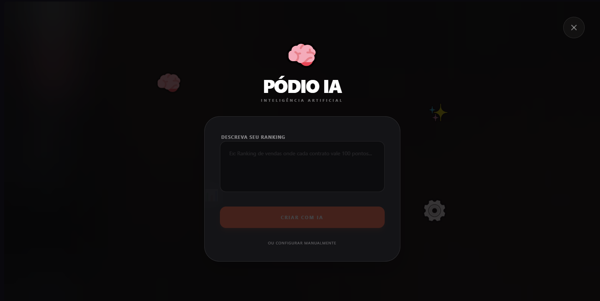

# 🚀 Rank&Hub - Ecossistema Gamificado de Rankings

  
  
<h3>Transforme metas em competição, engajamento e resultados extraordinários.</h3>

   

  

    
  

  
  
<i>Acesse o projeto oficial e explore todas as funcionalidades em tempo real.</i>

---

## 📸 Experiência de Competição Completa

### 🔐 Autenticação & Entrada Premium
A primeira impressão importa. Uma interface de login elegante e moderna que convida o usuário para o ecossistema.

  

 

### 📊 Dashboard Estratégico & Rankings
Acompanhe os principais indicadores de performance (KPIs) com uma interface visual limpa, moderna e focada na progressão dos usuários.

  

 

### 🤖 Inteligência Artificial & Gestão
Criação de regras inteligentes via Gemini AI para automatizar a gamificação e engajar os membros.

  

---

## ✨ Diferenciais do Ecossistema

- **Design Premium:** Interface moderna, intuitiva e totalmente responsiva com animações fluidas via Framer Motion.
- **Inteligência Artificial:** Geração dinâmica de regras e descrições utilizando a API do Google Gemini.
- **Backend Híbrido:** Suporte nativo para SQLite (local) e PostgreSQL Neon (produção) com transição transparente.
- **Gamificação Ativa:** Sistema de badges, notificações por e-mail e ciclos de competição automatizados.

---

## 🛠️ Stack Tecnológica

O **Rank&Hub** utiliza o que há de mais moderno no desenvolvimento full-stack para garantir performance e escalabilidade:

- **Frontend:** Next.js 15 (App Router)
- **Backend:** Python Flask
- **AI Engine:** Google Gemini AI
- **Database:** PostgreSQL (Neon)
- **Estilização:** Vanilla CSS & Framer Motion

---

## 📧 Contato Comercial & Desenvolvedor

**Carlos André** — *Especialista em Soluções SaaS*  

  
© 2026 Rank&Hub • Ecossistema de Gamificação

